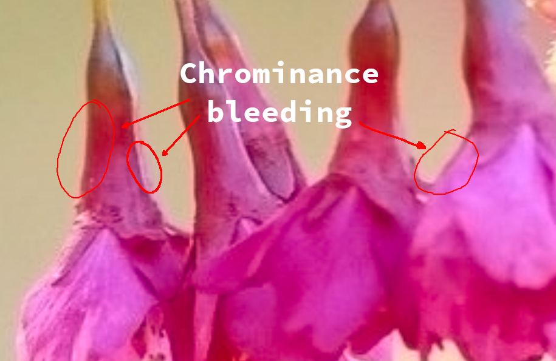
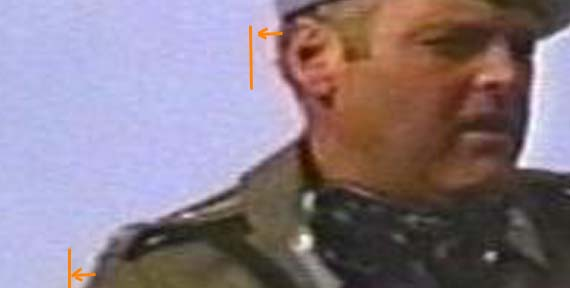

# Pansharpening

## From DIMPROC perspective
Pansharpening appears to do its thing by ripping color
information from a lower-resolution multichannel (colored)
image and force-feeding it into the higher-resolution
panchromatic (grayscale) image, producing sharp edges with
possibly hard-to-notice color blurring.  

## From Analog Video perspective
Replace "multichannel" with "chrominance" and "panchromatic"
with "luminance" and you basically get [Chroma subsampling](https://en.wikipedia.org/wiki/Chroma_subsampling).  

  
[Image source](https://forum.videohelp.com/threads/246275-Is-it-Color-Chroma-Shift-or-Bleed-or-Smearing-can-I-improve-it)

