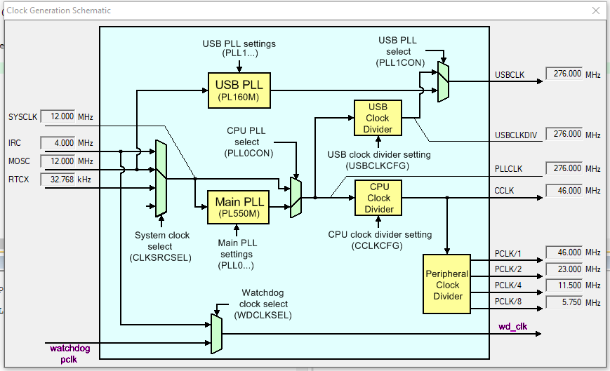

#### Setup
This really has no source code, we just have learned about frequency multiplication, set up certain frequency values using it and screenshotted the resulting values within a debug session.

##### 40 MHz

##### 46 MHz

##### 86 MHz

