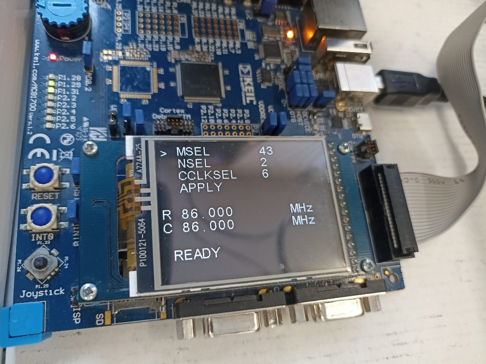

#### Clock speed
* Extends the LED blinker project by adding a graphical menu to operate values for the values that shall go to the system registers after an apply operation.
* The code for changing the rate at which LEDs change their state and their count has been removed as LEDs now only practically prove that the frequency is changed.

##### Interface description
```
> MSEL		43
  NSEL		2
  CCLKSEL   6
  APPLY

R 86.000		MHz
C 86.000		MHz
```

1. The `>` bit shows the selected value, use joystick UP/DOWN to select a different value.
2. The values of the selected value can be changed with joystick LEFT/RIGHT, in case of `APPLY`, values are written to system registers.
3. The `C` and `R` values display respectively calculated and real frequencies. Calculated frequency is deduced from the values inputted by the user while real frequency is calculated using system registers.
4. The status bar normally displays the `READY` status that updates every single joystick action, if the calculated frequency is invalid (zero or over the limit), the calculated values will be reset with system register values and the `INVAL` status will be set.

##### Interface


