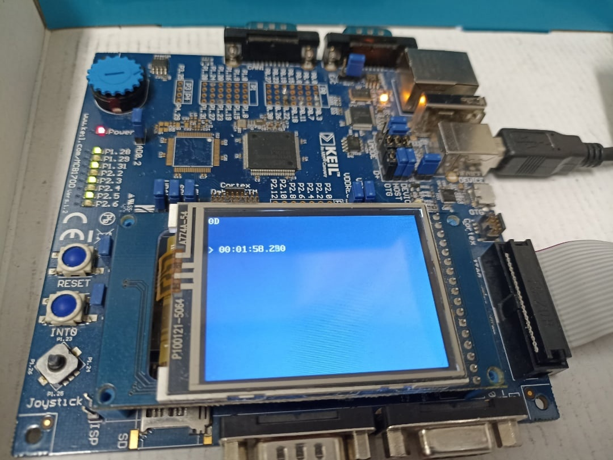

#### UART
Initializes the board's `UART1` controller at a fixed and set up baud rate, then reads commands in REPL mode.

##### REPL mode
1. Prints a prompt character.
2. Waits for the input buffer to contain a CR (`\r`) character. If the buffer has no more space available, prints an error message, drops the input buffer, then _GOTO 1_.
3. Replaces the first CR character within the buffer with a NUL (`\0`) character.
4. Evaluates the command.
5. Drops the input buffer.
6. _GOTO 1_.

##### Command syntax
1. Commands are comprized of up to four words separated by an indefinite non-zero amount of whitespace characters (determined by `int isspace(int)`). Any arguments exceeding the physical argument limit are dropped.
2. The parsed arguments are stored in an array called `argv` with the argument count stored in `argc`, parsing commands is done via standard C library functionality (`<string.h>`).

##### Command list
###### `led <id> <action>`
* Controls the LED stack.
1. `id` is a decimal LED index in range from 1 to 8.
2. `action` is a string containing either `on` to turn the LED on or `off` to turn it off.

###### `color <register> <color>`
* Controls the `lib_lcd` background and foreground text colors.
1. `register` is string containing either `bg` to set the background color or `fg` to set the foreground color.
2. `color` is a 16-bit hexadecimal value representing the _RGB565_ color.

###### `timer <action>`
* Controls the timer (see `timer` project for base implementation). The timer's ticks update every 5 milliseconds.
1. `action` is a timer action.  

|action|description|
|------|-----------|
|`stop`|Stops counting|
|`start`|Starts counting|
|`restart`|Clears the counter and starts counting|
|`clear`|Clears the counter|
|`show`|Shows the human-readable time on LCD|
|`hide`|Hides the human-readable time on LCD|

###### `help`
* Prints a help message containing a list of available commands.

##### Interface description
```
XX XX XX ... XX XX

# HH:MM:SS.MMM
```

1. The first line prints values within the input buffer in hexadecimal form.
2. The last line prints the timer counter value in human-readable form. The only thing differing from the previous (timer) project is that the timer status is now displayed to the left of the counter. The value of `#` means the timer is not counting while the value of `>` means the timer is in fact counting.

##### Interface


##### Host interface (in PuTTY)


##### Host interface (in POSIX environment)
`TODO: write a <termios.h> using app`

