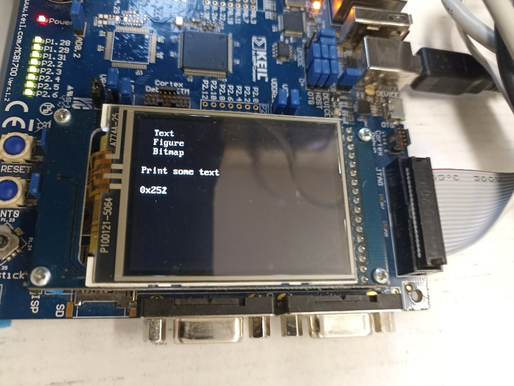

#### Graphics
* Provides a text-based interface to choose to display certain objects on screen.
* Prints a bit of Lorem Ipsum text using IBM BIOS font (8x8) and IBM VGA font (8x16).
* Draws a graphical object (gradient using `GLCD_Bargraph` before, flag of Ural Republic using `lcd_rect` now).
* Draws a bitmap image (an Among Us crewmate with red, green and blue stripes near it).

##### Interface description
```

> Text
  Figure
  Bitmap

Print some text

0x255
```

1. The `>` bit shows the selected screen, use joystick UP/DOWN to navigate.
2. Using joystick LEFT/RIGHT selects the screen and begins drawing it.
3. Usually (depends on screen update function) joystick LEFT/RIGHT returns to the menu screen.
4. The text under the selection interface describes what kind of screen does the currently chosen entry have.
5. The lowest line of text is a hexadecimal value of the tick counter.

##### Menu screen


##### Text screen


##### Figure screen (old)


##### Bitmap screen


